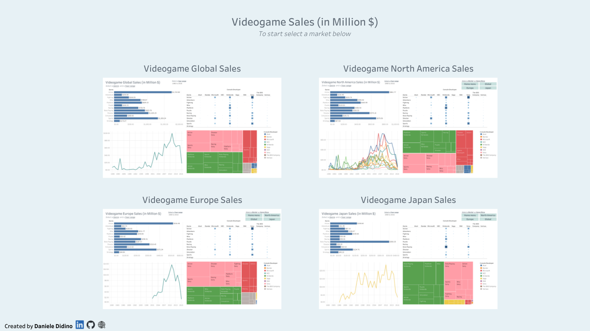
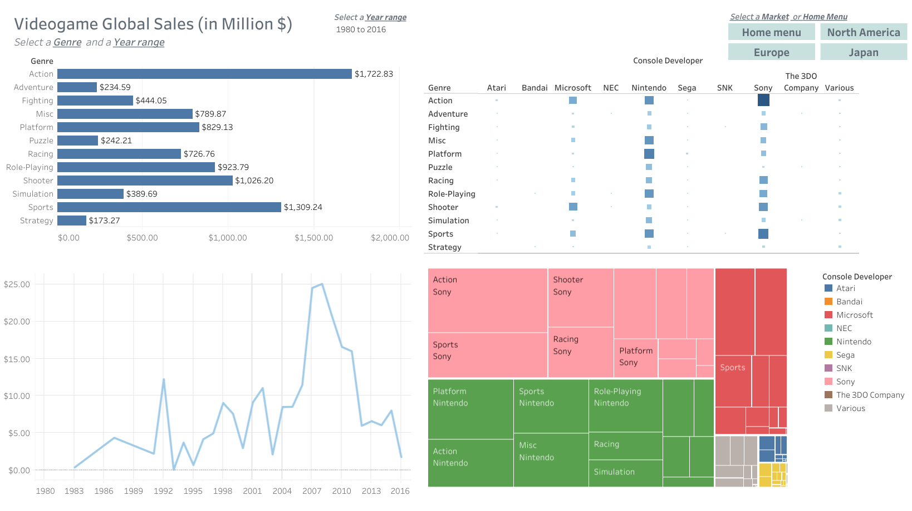

<h1 align="center">
Global Videogame Sales (1980-2016)
 
 

</h1>

In this repository, you'll find the preprocessing steps I performed on the data before loading it into Tableau to create a Dashboard. 

Click [here](https://public.tableau.com/views/GlobalVideogameSales1980-2016/D-GL2_1) or on the figure to start exploring the interactive dashboard!

The interactive Tableau Dashboard delves into the dynamic world of video game sales from 1980 to 2016. This comprehensive visualization breaks down the sales data by genre and market, including global, North America (USA, Canada), Europe, and Japan. Users can personalize the view by selecting specific year ranges to focus on trends that matter most.

 Global Video Game Sales Overview

The dashboard features four distinct graphs:

- **Bar Plot**: Analyzes sales across different game genres.
- **Heat Map**: Displays sales data by genre and console developer (e.g., Nintendo, Sony, etc.).
- **Sales Over Time**: A line plot showing the trajectory of sales from 1980 to 2016.
- **Treemap**: Visualizes sales distribution by console developer and genre, highlighting market leaders and trends.

This dashboard offers insights into the shifts and trends in the video game industry.

You can access the original dataset on Kaggle [here](https://www.kaggle.com/datasets/thedevastator/global-video-game-sales/data). This dataset contains a list of video games with sales greater than 100,000 copies.
It was generated by a scrape of [vgchartz.com](https://www.vgchartz.com/).

For more information, please visit my website [here](https://danieledidino.github.io/).
